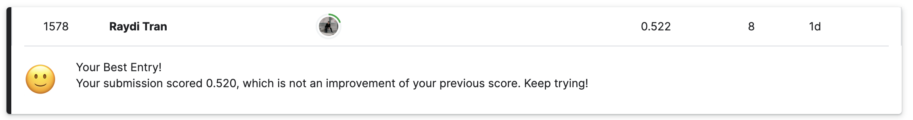

# Credit Risk Model Stability

Welcome to my first Kaggle prized competition repository. A series of repos where I applied my Machine Learning skills into these Kaggle competition. If you're here because of the last repo, I sincerely thank you for your interests in my works 🥰.

By the time I updated the README, my leaderboard position was:

Not the result I wanted, but this series gives me lots of opportunities to continuously practice my ML skills. You can checkout the [Kaggle notebook]([model.ipynb](https://www.kaggle.com/code/rayditran/home-credit)) to see how I got the score. The [local notebook](model.ipynb) is where all of my testing are. 

I'm available for future collaboration, feel free to message me. Cheers :)!